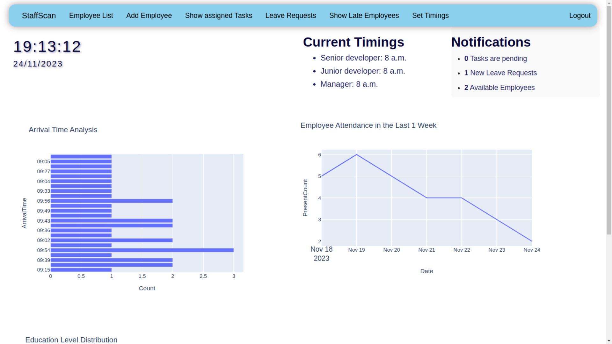

# StaffScan End-to-End Project for SSIP Hackathon 2023

staffscan is an employee management and attendance tracking web application built with Django. It was created as an end-to-end project for the SSIP Hackathon 2023.

staffscan was selected amongst the top 181 finalists to present at the hackathon grand finale. Although we did not end up as the winner, being selected for the finale demonstrates staffscan's quality and innovation. Feedback from judges was very positive, praising in particular staffscan's polished user interface and extensive functionality considering the short 24 hour hackathon duration.

## Features

- Employee attendance tracking using facial recognition 
- Admins can assign tasks to employees
- Late employee tracking and auto-penalty application
- Customizable employee arrival times based on positions
- Admin dashboard showing attendance overview, notifications, and insights via graphs
- Employees can view assigned tasks and mark them as completed
- Leave requests with visibility on admin dashboard
- Attendance data export for employees and admins

## Getting Started

### Prerequisites

- Python 3.9
- Django
- Open-CV
- MySql Server
- Other dependencies listed in requirements.txt

### Installation

1. Clone the repository
   ```
   git clone https://github.com/your_username/staffscan.git
   ```
2. Navigate into the project directory
   ```
   cd staffscan
   ```
3. Install dependencies
   ```
   pip install -r requirements.txt
   ```
5. Create database tables given in 'hackathon.sql' file.
6. Start development server
   ```
   python manage.py runserver
   ```
   
The application will now be running at **127.0.0.1:8000**

## Usage

* Employees can punch in punch out with face recognition.
* Admins have access to dashboards for attendance, leave, tasks etc. 
* Tasks can be assigned to individuals or groups
* Leave requests visible to admins
* Downloadable attendance data in CSV format

## Architecture


- Django framework managing overall application and Firebase API
- MySQL database
- Face recognition API for attendance

## Online Live Demo
A live demo of staffscan is available at: hiren88.pythonanywhere.com

Please note that the online demo is running on the free plan of PythonAnywhere and may only be available for 1-2 months before being taken down. Use the source code to run the app locally if the demo is no longer running.
**Demo credentials**
_Admin Account_
username : admin,
password : password

_Employee account_
email : limbadhiren00@gmail.com
password : limbadhiren00@gmail.com

		

## Contributing
Contributions to staffscan are welcome! We greatly appreciate any contributions to make staffscan better.

We encourage you to pitch in and contribute to the project! Every bit helps and even small fixes/additions are valuable.